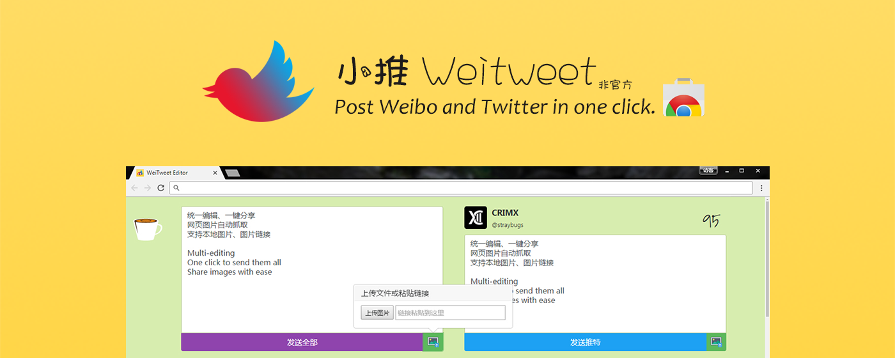

# 小推 WeiTweet

A chrome extension written in Vue & Vuex.

<p align="center">
  <a href="https://chrome.google.com/webstore/detail/jcgjbjbbcjgkpdanbnafdbdlbjacdkln" target="_blank"></a>
</p>

一键编辑发送推特与微博。<br/>
Post Weibo and Twitter in one click.

<h2></h2>

- 统一编辑，也可以分开编辑
- 网页图片自动抓取
- 支持本地图片、图片链接、图片直接粘贴

<h2></h2>

- Multi-editing.
- One click to send them all.
- Auto extracts images from page.
- Image upload. Url pasting. Image pasting

<h2></h2>

理论上支持所有 Chrome 系浏览器，已测试 Google Chrome、猎豹、360se、360Chrome、QQ浏览器。（猎豹上使用图片抓取需要勾选允许访问敏感信息）

开源，不收集任何数据，不占后台。<br/>
Open source. No data collection. Low background memory and CPU footprint.

# Downloads

- Chrome Web Store: <https://chrome.google.com/webstore/detail/jcgjbjbbcjgkpdanbnafdbdlbjacdkln>
- crx: <https://github.com/crimx/crx-weitweet/releases/>

# Changelog

- v0.3.6
  - 修复微博新 api 问题
- v0.3.3
  - 支持 base64 图片
  - 支持编辑框直接粘贴图片
- v0.1.3
  - 应微博平台要求修改名字和 LOGO
- v0.1.2
  - 修复微博图片发送问题
- v0.1.1
  - 修复在旧版本 Blink 上的 Flex bug，影响编辑框的高度

# Privacy Policy & Terms of Service

小推Weitweet 通过 Oauth 授权方式为用户提供连接推特和微博功能，相关用户信息会通过浏览器存储在本地。除此以外本扩展不收集任何信息。扩展安全性依赖于微博平台、推特平台以及浏览器供应商，使用风险由用户承担。

小推Weitweet offers account connections with Twitter and Weibo through Oauth service. User related data is stored locally in the browser. Other than that the extension collects no further information. Extension security relies on Weibo platform, Twitter platform and Browser porviders. The use of this extension is at the user’s own risk.

# Development

- `yarn install`(recommended) or `npm install`
- add `src/editor/store/oauth-client.js`
  ```javascript
  export default {
    twitter: {
      id: 'xxx',
      secret: 'xxx'
    },
    weibo: {
      id: 'xxx',
      secret: 'xxx'
    }
  }
  ```
- check package.json for npm scripts
